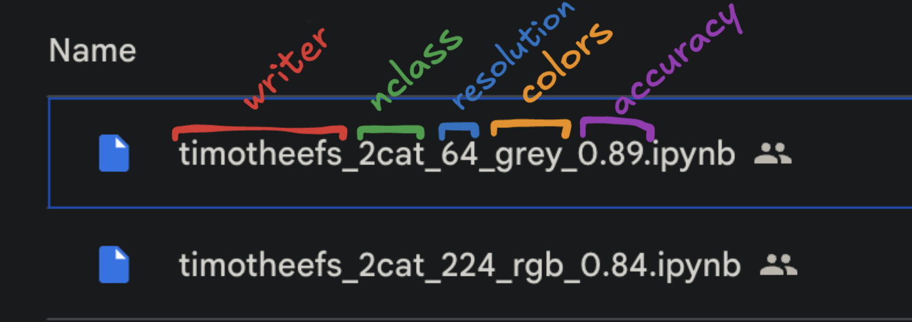

# celebtwin

Who is your celebrity twin?

# Pitch présentation

https://docs.google.com/presentation/d/1yMgBvycpkQwYnkkpdM_pyO8D9fKHkx4FH9EWrY3DhA4/edit?usp=sharing

# Le data set

https://www.kaggle.com/datasets/hereisburak/pins-face-recognition/code

# links

## Triplet Loss – Advanced Intro

https://towardsdatascience.com/triplet-loss-advanced-intro-49a07b7d8905/

## nomenclature nommage des notebook

# pipeline

## entrainement

`make train`
-> save le modele en local dans ./training_outputs/models + ./training_outputs/metadata

## entrainement sur le google compute engine

executer une instance `./bin/setup_instance`

Se connecter en ssh sur l'instance :

`gcloud compute ssh --project $PROJECT --zone $ZONE $INSTANCE -- -A`
`$PROJECT`, `$ZONE`,  `$INSTANCE` -> dans Makefile

## promotion d'un modele en production

Dans google cloud storage, déplacer le fichier (bouton ...>déplacaer) depuis
* depuis `/celebtwin/models/staging`
* vers `/celebtwin/models/production`

## première cration du dépot google artefacts registry

`make image-create-repo`

## déploiement de l'application API (service web qui sert l'api /predict)

`make image-prod`
`make image-auth` <- une unique fois
`make image-push`
`make image-deploy`
